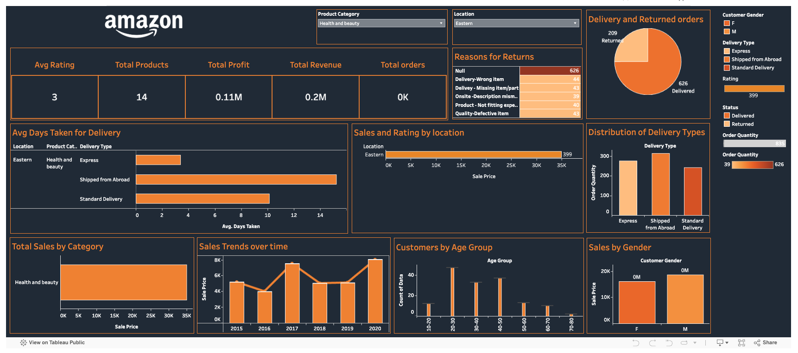
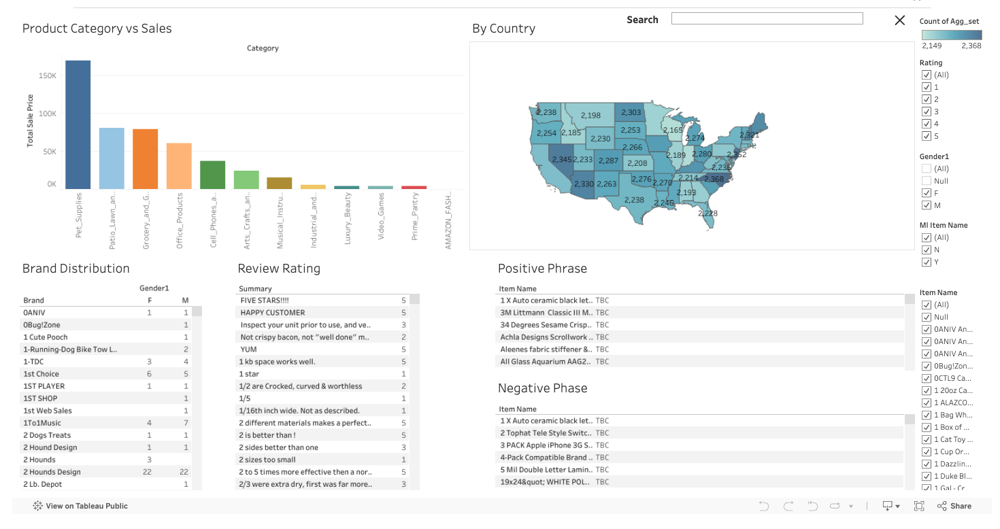

# Enhancing the Quality of Amazon Reviews

## Acknowledgement
- [Brainstation](https://brainstation.io/)
- [Kaggle](https://www.kaggle.com/datasets/rogate16/amazon-reviews-2018-full-dataset)
- [Postman](https://www.postman.com/)
- [Tableau](https://www.tableau.com/)
- [Thunder Client](https://www.thunderclient.com/)
- [Vite](https://vitejs.dev/)
- [npm](https://www.npmjs.com/)

## Author
- [Bhargav Devarapalli](https://github.com/bhargavddb)
- [Gennaro Costantino](https://github.com/gennarocostantino)
- [Matthew Jung](https://github.com/matthewjung04)

## Documents
- [Tableau API](https://help.tableau.com/current/api/rest_api/en-us/REST/rest_api.htm?_gl=1*nbp8q6*_ga*MTQzNzk0OTA5LjE3MzAyNDkxNDM.*_ga_8YLN0SNXVS*MTczMDc3Mjc4OS4xNi4xLjE3MzA3NzI4MDQuMC4wLjA.)

- [Tableau Embedded API](https://help.tableau.com/current/api/embedding_api/en-us/index.html)

## Usage
- To install the project use: `$ npm install`
- To run the project use: `$ npm run dev`

## Installed Packages
- [npm axios](https://www.npmjs.com/package/axios)    
    - Installation:
    `$ npm install axios`

- [npm dotenv](https://www.npmjs.com/package/dotenv)    
    - Installation:
    `$ npm install dotenv --save`

- [npm js-file-download](https://www.npmjs.com/package/js-file-download)    
    - Installation:
    `$ npm install mjs-file-download`

- [npm react-router-dom](https://www.npmjs.com/package/react-router-dom)
    - Installation:
    `$ npm install react-router-dom`

- [npm sass](https://www.npmjs.com/package/sass)    
    - Installation:
    `$ npm install sass`

## Development

### Phase 1: Finding a Data Source from Amazon
- Source: Amazon Reviews 2018 Full Dataset from Kaggle [Link](https://www.kaggle.com/datasets/rogate16/amazon-reviews-2018-full-dataset)
- Objective: Extract relevant review data for analysis.

### Phase 2: Data Cleaning and Feature Engineering
- Steps: Remove unnecessary fields, handle missing values, and structure data for sentiment analysis.
- Key Focus: Prepare data for high-quality insights.

### Phase 3: Enhancing Review Quality Through Model and Guideline Adjustments
- 3.1 Adjusting Amazon Guidelines
 - Current Threshold: Minimum spend of $50 to qualify as verified.
 - Proposed Threshold: Spend of at least $30 or 3 transactions.
 - Outcome: Improved prediction accuracy (by ~1%) with adjusted thresholds.
- 3.2 Identifying Key Phrases:
  - Method: Using bigrams to detect top positive and negative phrases.
  - Purpose: Quick, high-impact insights for customers and sellers.
  - Result: Higher accuracy in representing review sentiment for key phrases.

### Phase 4: 
- Filters for sentiment and keyword searches.
- Visualization of positive/negative sentiment trends.
- Link to Tableau dashboard [Link](https://public.tableau.com/app/profile/bhargav.devarapalli/viz/test_test_17305772805390/Dashboard1?publish=yes)

### Phase 5: Public-Facing Interactive Website
- Goal: Provide insights to users and sellers for better purchase decisions.
  - Embedded Tableau using React and JavaScript Tableau Library
  - Style taleau and UI pages using Sass styling
- Platform: Interactive website that hosts the review insights for public use.
  - Use APIs to create forms for users to input fields to generate selective data

## Tableau Screenshots

### Reference Amazon Tableau

### Project Main Tableau

## Tech Stack
- Python (Data Science Libraries)
- Tableau
- React, vite, npm
- node.js
- express.js
- JavaScript (js, jsx)
- HTML
- CSS, SASS
